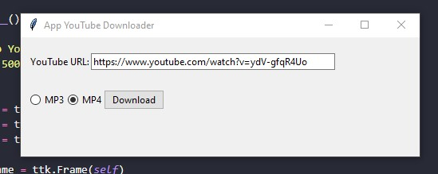

## :space_invader: Sobre

Este código é um script Python para um aplicativo de download do YouTube. Ele usa o pacote tkinter para criar uma interface de usuário com um campo de entrada de texto para inserir um URL de vídeo do YouTube e botões de opção para selecionar downloads de vídeo ou áudio. Ele também usa os pacotes pytube e moviepy para baixar e processar os vídeos.



## :wrench: Requisitos

Para instalar as dependências necessárias, execute o seguinte comando:

```bash
pip install -r requirements.txt
```

## :runner: Uso

Para executar o código no terminal, você precisaria salvá-lo em um arquivo, como bot.py, e executá-lo usando o comando:

python bot.py


# Copyright (c) 2023 Estevao Fonseca
